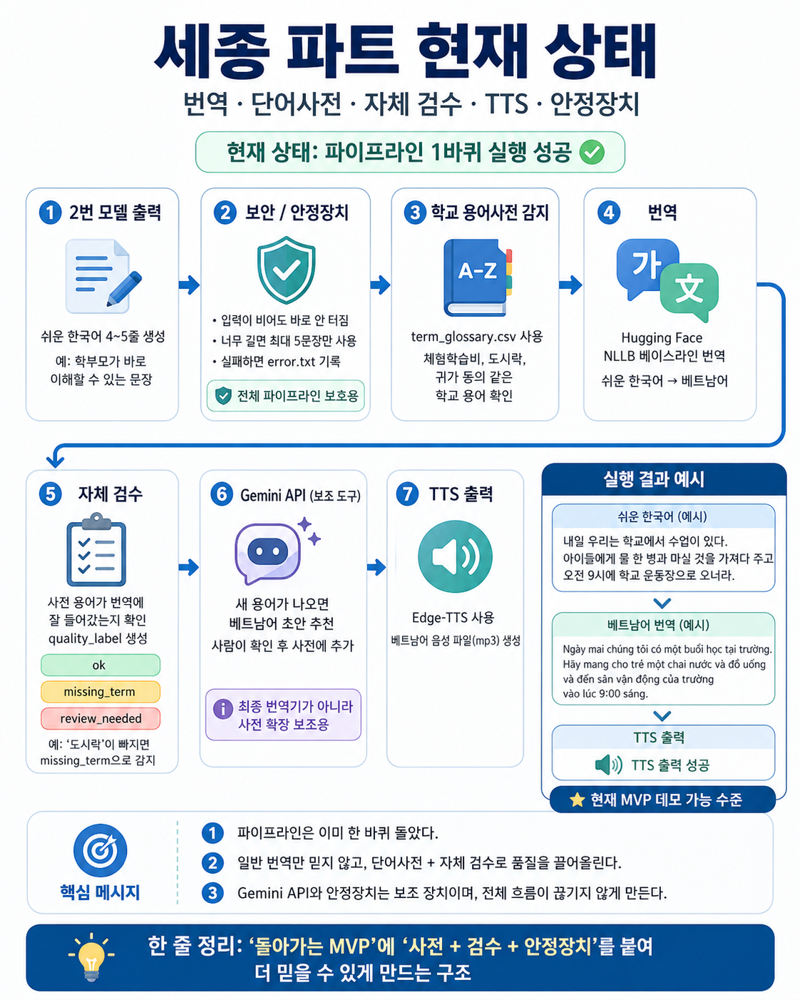

# Translation/TTS MVP



## 현재 상태

Translation/TTS 파트는 쉬운 한국어 입력에서 다국어 번역, 학교 용어사전 검수, Edge-TTS 음성 출력까지 1차 MVP 실행을 완료했다.

핵심은 단순 번역이 아니라 `번역 + 용어사전 검수 + TTS + 실패 안전장치` 흐름이다. 일반 번역 결과가 자연스럽더라도 `도시락 -> cơm hộp`처럼 학교 안내문에서 중요한 준비물 용어가 누락될 수 있으므로, glossary check로 검수 지점을 명확히 남긴다.

2026-04-28에는 품질평가 근거자료를 팀 repo에 반영했다. 기존 `max_length=256` 기반 번역 잘림을 문장 단위 청크 번역으로 줄였고, Gemini 평가에는 현지 상용 표현 여부와 한국어 의미 역번역(Round-trip) 검사를 추가했다.

## 주요 파일

- `run_mvp_pipeline.py`: MVP 파이프라인 실행 스크립트
- `term_glossary.csv`: 학교 특화 한국어-다국어 용어사전
- `languages.py`: NLLB target code 및 TTS voice 매핑
- `run_ab_compare.py`: 원문 전체 번역(A)과 TODO 추출 번역(B) 속도/입력량 비교
- `run_ab_quality_eval.py`: A/B 번역 품질 평가. 현지 자연스러움과 Round-trip 검사를 포함
- `run_glossary_compare.py`: NLLB 원번역의 용어사전 반영률 확인
- `run_quality_eval.py`: 용어사전 전/후 품질 평가
- `requirements-translation-tts.txt`: 번역/TTS 파트 실행 의존성
- `../../data/translation_tts/easy_ko_text_sample.csv`: 샘플 입력
- `../../demo/translation_tts/demo_case_01/`: 고정 데모 산출물
- `outputs/`: 발표 근거용 평가 요약 결과

## 실행 예시

```bash
python model/translation_tts/run_mvp_pipeline.py --input data/translation_tts/easy_ko_text_sample.csv --output-dir outputs/mvp/vi --lang vi --save-demo-case demo_case_01
```

## 평가 재실행

```bash
python model/translation_tts/run_ab_compare.py --lang vi --device cpu
python model/translation_tts/run_ab_quality_eval.py --lang vi
python model/translation_tts/run_glossary_compare.py --lang vi en zh th ja ru ms mn
python model/translation_tts/run_quality_eval.py
```

## 데모 케이스

`demo/translation_tts/demo_case_01/`에는 다음 산출물을 고정 보관한다.

- `01_easy_ko_input.txt`
- `02_vi_raw_translation.txt`
- `03_glossary_check.csv`
- `04_review_needed.md`
- `05_vi_corrected_translation.txt`
- `06_tts_output.mp3`
- `demo_summary.md`

## 2026-04-28 평가 요약

| 항목 | 결과 |
|---|---:|
| A/B 입력 단축 | -30.1% |
| A/B 속도향상 | x1.84 |
| A/B 품질평가 | A 50.1점 / B 54.1점 |
| 용어사전 전/후 품질평가 | 39.0점 -> 89.6점 |

공유용 요약은 `../../docs/share-summary-2026-04-28-quality-eval.md`에 정리했다.
